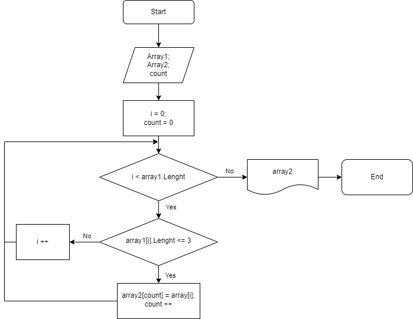

# Финальное задание #

## Задача: ##
Написать программу, которая из имеющегося массива строк формирует массив из строк, длина которых меньше либо равна 3 символа. Первоначальный массив можно ввести с клавиатуры, либо задать на старте выполнения алгоритма.

## Алгоритм решения: ##
- Обьявляем 2 массива: первый с задаными строками, второй пустой. Оба одинаковой длины.
- Прописываем метод, в котором цикл перебирая все элементы массива, проверяет их на условие (длинна элемента должна быть <= 3). Если элемент массива соответствует условию, то он заносится во второй массив попорядку, а не аналогично номерам элементов первого массива.
- После выполнения метода, заполненый второй массив выводится на печать.

Схема алгоритма:

